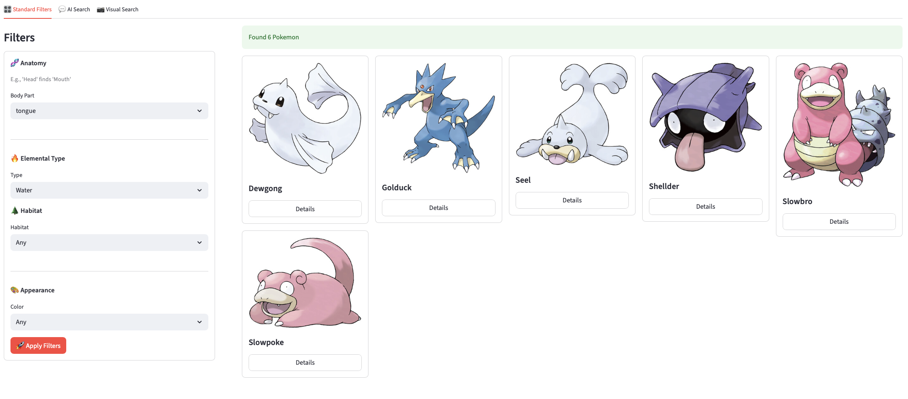
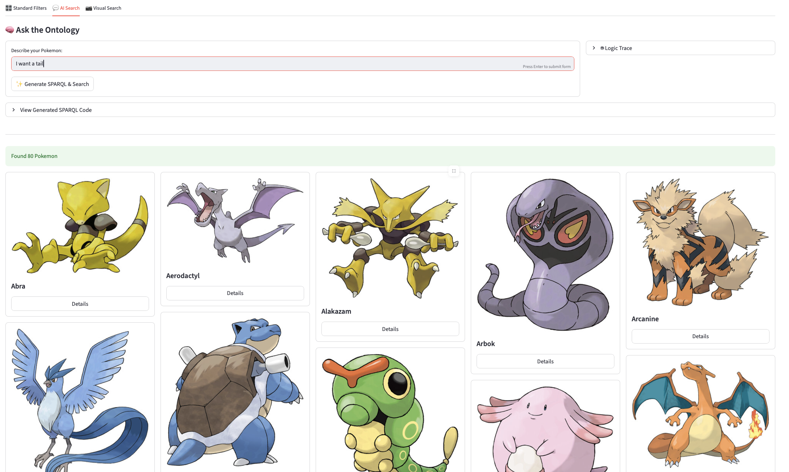
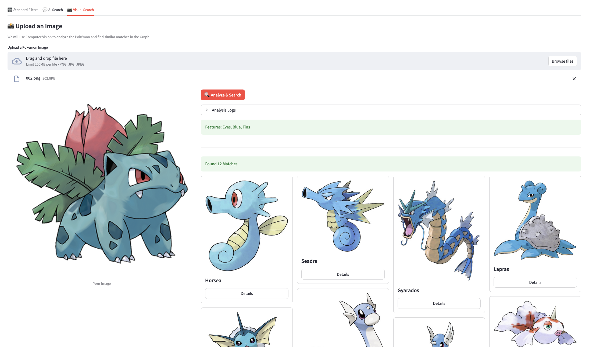

# Semantic Pokédex - Setup & Running Instructions

This project is a **Semantic Web Application** that combines a Knowledge Graph (GraphDB) with Computer Vision (YOLO) to search for Pokémon.

---

## ✅ Prerequisites
* **Docker Desktop** (Installed and running).
* **Python 3.9+**.

---

## 🚀 Step 1: Start the Database (Docker)

1.  Open a terminal in the project root folder.
2.  Start the GraphDB container:
    ```bash
    docker-compose up -d
    ```
3.  Open the **GraphDB Workbench** in your browser: `http://localhost:7200`
4.  **⚠️ CRITICAL STEP (Data Import):**
    * Go to **Setup** -> **Repositories** -> **Create New Repository**.
    * **Repository ID:** `pokemon-repo` (Must match this exact name).
    * Click **Create**.
    * Go to **Import** -> **Upload RDF Files**.
    * Upload all files from the `data/` folder (Select both `.ttl` and `.nq` files).
    * Click **Import**.

---

## 💻 Step 2: Run the Application (Python)

1.  Open a **new** terminal window in the project root.
2.  Create and activate a virtual environment:
    ```bash
    # Windows
    python -m venv .venv
    .venv\Scripts\activate

    # Mac / Linux
    python3 -m venv .venv
    source .venv/bin/activate
    ```
3.  Install dependencies:
    ```bash
    pip install -r requirements.txt
    ```
4.  Run the dashboard:
    ```bash
    streamlit run app/main.py
    ```

---

## 🌟 Features & Modules

### 1. Semantic Search
* **Location:** Home Page -> "Standard Filters" & "AI Search".
* **Description:** Search the Knowledge Graph using natural language (e.g., *"I want dragon wings"*).
> **See it in action:**
> 
> 

### 2. 📊 Knowledge Statistics
* **Location:** Sidebar / Stats Page.
* **Description:** A dashboard that analyzes the inference capabilities of our Ontology.
* **Metrics:** Calculates the **Inference Ratio** and counts **Characteristic Triples** to demonstrate the "Semantic Value" of the graph.

### 3. 📷 Visual Search (Computer Vision)
* **Location:** Home Page -> "Visual Search" Tab.
* **Description:** Upload an image to detect features (e.g., "Wings", "Red") using **YOLOv8** and **HSV Color Detection**. The system bridges these detected tags to the Knowledge Graph to find similar Pokémon.
> **See it in action:**
> 
* **🧪 Evaluation Note:** For the detailed testing, validation, and accuracy results of the Computer Vision models, please refer to the Jupyter Notebook:
    > **`app/utils/visual/main.ipynb`**
---
